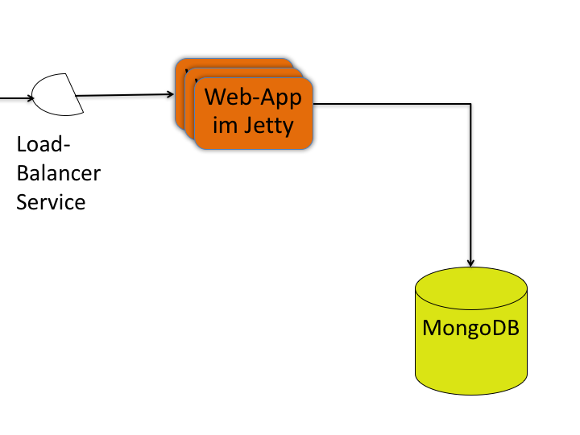
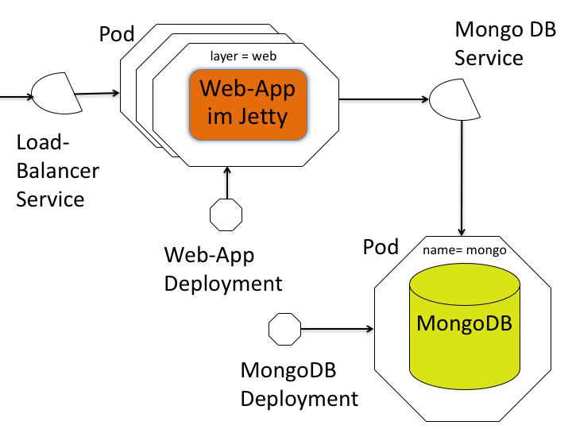

# Single MongoDB Kubernetes setup on the Google Cloud Platform
This setup allows to horizontally scale the web-app in Jetty and to release a new version of the web-app without downtime. Every web-app connects to the same MongoDB instance. But it will be automatically restarted by the Kubernetes Deployment if it's process dies. 

## The setup

                                 
## Create the project
1. Go to the [Google Cloud Console](https://console.cloud.google.com)
1. Create a project for this setup from the dropdown left beside the big search field. We will call it `sling-single-mongo` in this example
1. Navigate to the Container engine from the menu on the left and activate it.

## Create the cluster ...
The following commmand creates a cluster of 3 g1-small nodes in the US. You find the pricing [here](https://cloud.google.com/compute/pricing#predefined_machine_types). We will be using the name `sling-cluster` throughout this project.

    gcloud container \
    clusters create "sling-cluster" \
    --project "sling-single-mongo" \
    --zone "us-central1-a" \
    --machine-type "g1-small" \
    --num-nodes "3" \
    --network "default"
  
## Or authenticate with an existing Google Cluster
    gcloud container clusters get-credentials sling-cluster \
      --project "sling-single-mongo" \
      --zone "us-central1-a"
  
## The concrete Kubernetes setup
You are about to create the following Kubernetes setup:

The file `db-deployment.yml` describes the [Deployment](https://kubernetes.io/docs/concepts/workloads/controllers/deployment/) of the [https://kubernetes.io/docs/concepts/workloads/pods/pod/](Pod) with the label `name=mongo`. It initially creates the Pod with a new cluster ip and makes sure that it is recreated if the process dies.
It also specifies (`spec`) the Pod template that should be used to (re)create the [https://kubernetes.io/docs/concepts/workloads/pods/pod/](Pod). It describes the image name `mongo` at Docker-Hub that should be used, the Container- and the Pod-Port and the mount that should be used to store the data.
As the web-app does not know in advance the port of the MongoDB that the [Deployment](https://kubernetes.io/docs/concepts/workloads/controllers/deployment/) will use it is setup to use the DNS name `mongo` as you see in the `web-deployment.yml`. The Kubernetes [Service](https://kubernetes.io/docs/concepts/services-networking/service/) defined in `db-service.yml` creates a DNS entry to make sure to always return the right MongoDB Pod-IP for the name `mongo`. It finds it by using the [label](https://kubernetes.io/docs/concepts/overview/working-with-objects/labels/) selector.

The `web-deployment.yml` (similar to the `db-deployment.yml`) (re) creates two Pods for the web-app. They are configured to use the application image we previously uploaded to Docker-Hub. The [readiness probe](https://kubernetes.io/docs/tasks/configure-pod-container/configure-liveness-readiness-probes/) does an HTTP-GET on /mynode.test and checks if the 200 status is returned to tell the load balancer Service that it can handle requests or that it should be removed from the load balancer if it is currently not ready. If a Pod gets unavailable the Service only knows it from periodic testing. If requests arrive the web server in the Pod during that period when the service has not yet recognized that the Pod is down it will get errors. To avoid that, the `preStop` hook sets the Pod to unready before it is [terminated](https://kubernetes.io/docs/concepts/workloads/pods/pod/#termination-of-pods) and waits a few seconds to give the load balancer time to recognize the unreadiness and remove it from the list of serving pods before errors will be returned. 

The `../web-service.yml` file defines the Kubernetes Service of type load balancer for the Pods labeled `layer=web`. It provides a public IP address and forwards the requests to the Pods that are ready. If Pods (re) start they will get new cluster-local IP addesses but the Service knows them by using the selector and can still provide the web-app service to the stable external IP.

## Applying the setup within the `single-mongo` folder
1. Creating the disk for the database
  `gcloud compute disks create  --project "sling-single-mongo" --zone "us-central1-a" --size 200GB mongo-disk`
1. Applying the DB instance and service 
  `kubectl apply -f db-deployment.yml`
  `kubectl apply -f db-service.yml` 
1. Applying the web instance and service after the DB Pods are available
  `kubectl apply -f web-deployment.yml`
  `kubectl apply -f ../web-service.yml`

## Get public IP address 
  `kubectl describe service -l name=web`

The one next to `LoadBalancer Ingress` is the one to be used for `http://<ip-address>/mynode.test`.

## Scale up
### Raise the number of nodes if needed
    gcloud container \
      clusters resize "sling-cluster" \
      --project "sling-replset-mongo" \
      --zone "us-central1-a" \
      --size 3
### Add web-application instances
Raise the number of replicas in the `web-deployment` file and call again
`kubectl apply -f web-deployment.yml`.

## Rollout a new application version
Call `watch -n 0.25 "curl http://<ip-address>/mynode.test"` to see every 1/4 second if it gets unavailable.
Change the image version in the `web-deployment` file (see example in the file) and call again
`kubectl apply -f web-deployment.yml`.
You will see that Pods get updated gracefully `curl` should not yield any errors from the requests of the curl command. 

## Pause project to avoid costs from Google
Set the number of replicas in the web-deployment and the MongoDB instance to `0` and call again
`kubectl apply -f` with the respective files. This way Kubernetes doesn't try to create pods after the nodes are removed from the cluster with the following command:

    gcloud container \
      clusters resize "sling-cluster" \
      --project "sling-replset-mongo" \
      --zone "us-central1-a" \
      --size 0

This stops creating costs for the nodes.
It hasn't been evaluated yet what other costs (load balancer, stores,..) need to be avoided and how to do that (except deleting the whole cluster or project).
  
## Cleanup

    gcloud compute disks delete \
      --project "sling-replset-mongo" \
      --zone "us-central1-a" \
      mongo-disk
  
    kubectl get all
    kubectl delete service --all
    kubectl delete deployments --all
    kubectl delete statefulset --all

    gcloud container clusters delete "sling-cluster" \
      --project "sling-replset-mongo" \
      --zone "us-central1-a" 